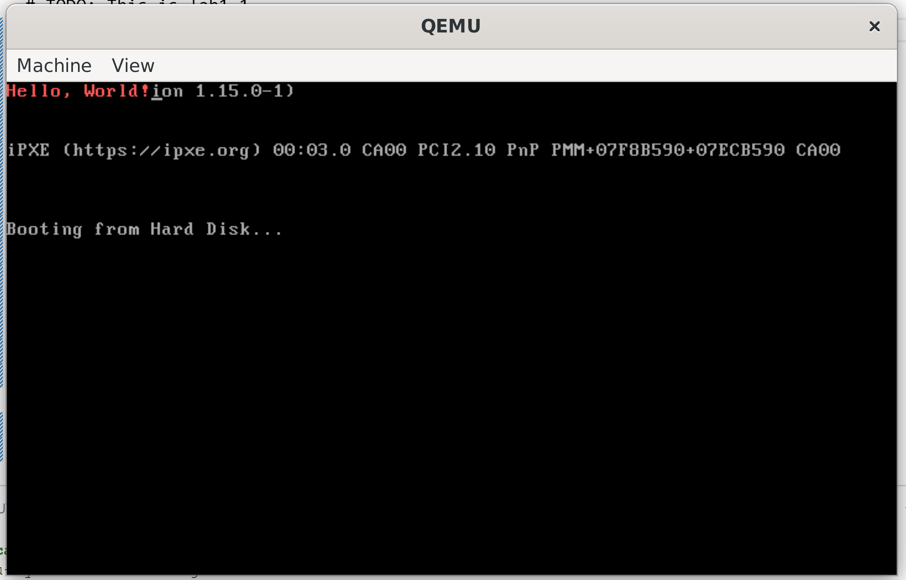

# NJU操作系统2023秋Lab1实验报告

姓名: 闻嘉迅  
学号: 211220091  
日期: 2023.9.24(最后修改)  
版本: v1.0  

## 实验进度
完成全部内容  

## 实验代码和结果

### Lab1.1

将相应代码拷贝到mbr.s中，编译后运行得到结果。  



### Lab1.2

实现步骤：  
修改start.s:  
- 在实地址模式下运行，初始化段寄存器    
- 使用cli指令关中断  
- 开启A20地址线以使用1MB以上的内存:
    ```  
    in $0x92, %al  
	or $0x2, %al   
	out %al, $0x92 
    ```  
- 通过GDTR加载全局描述符表:
    ```  
    gdt:
     .word 0x0000                           #GDT第一个表项必须为空
	 .word 0x0000
	 .word 0x0000
	 .word 0x0000
 
     .word 0xffff                    #代码段描述符
	 .word 0x0000
	 .byte 0x00
	 .byte 0x9a
	 .byte 0xcf
     .byte 0x00
        
     .word 0xffff                    #数据段描述符
	 .word 0x0000
	 .byte 0x00
	 .byte 0x92
	 .byte 0xcf
     .byte 0x00

	 .word 0xffff                           #视频段描述符
     .word 0x8000 
	 .byte 0x0b
	 .byte 0x92
	 .byte 0xcf
     .byte 0x00
    ```  
    - 将#0表项置零  
    - 填写各段描述符(采用扁平模式)  
- 将cr0的PE位置一以启动保护模式  
    ```  
    movl %cr0, %eax
	or $0x1, %eax
	movl %eax, %cr0 
    ```
- 根据GDT设置各段选择子，并初始化各段寄存器和ESP寄存器  
- 运行字符打印程序，显示字符串  

运行结果:  


## Lab1.3  

start.s的修改参照Lab1.2  
由于引导程序运行后转到bootMain函数运行，因此修改bootMain函数:  
- 首先设定函数指针指向0x8c00位置  
- 将磁盘#1扇区的相应二进制程序(字符打印程序)拷贝到0x8c00  
- 运行该位置的函数  
此函数实现了将磁盘中的目标程序装载到指定内存地址的操作，代码如下:  
```  
    void bootMain(void) {
        // FIXME
        void (*app)(void);
        app=0x8c00;
        readSect(app, 0x1);
        app();
    }

```  

运行结果如图:  
  

## 思考题  

### 1
CPU: 即中央处理器，负责处理输入的指令。  
内存: 负责存储程序运行中的代码和数据。  
BIOS: 即基本输入输出系统，计算机开机时负责进行系统自检，搜索启动设备(通常为硬盘)并加载MBR到内存。  
磁盘: 计算机的外部设备之一，负责存储数据和代码。  
主引导扇区: 即MBR，包含加载程序和分区表等部分。在BIOS成功加载MBR后，将会运行加载程序。  
加载程序: MBR的一部分，负责进行计算机的初始化和加载操作系统引导程序，用以启动操作系统。  
操作系统: 负责管理计算机的硬件资源并向其他用户程序提供服务的系统软件。

### 2
中断向量表用于管理并处理计算机的中断请求和异常。它将不同的中断向量编号映射到相应的中断处理程序的入口地址。  

### 3 
该脚本在检测目标程序大小是否合规后对其用0x00填充每个字节至510B，并在最后添加0x55、0xAA两个字节。使其能够被BIOS识别为可进行加载的MBR。  

### 4
就Lab1.3来说:  
计算机加电后，BIOS首先开始运行，自检通过后BIOS会尝试搜索启动设备并加载MBR，若成功则跳转至MBR运行其加载程序。加载程序首先在实地址模式下运行，随后开启保护模式，最后跳转至操作系统程序入口处执行OS程序。  
