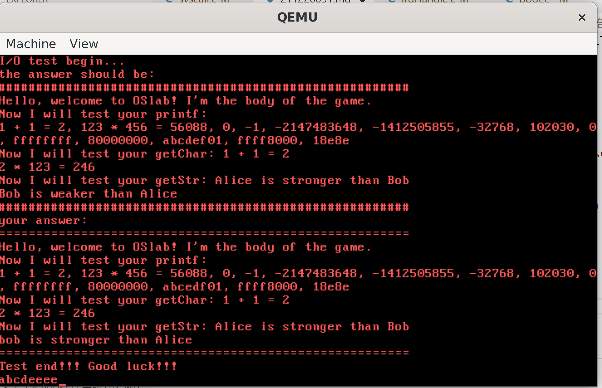

# NJU操作系统2023秋Lab2实验报告

姓名: 闻嘉迅  
学号: 211220091  
日期: 2023.10.28(最后修改)  
版本: v1.0  

## 实验进度
完成全部内容  

## 实验代码和结果

### 装载内核

通过填写函数入口地址和偏移量来加载内核程序。  

### 内核初始化程序

在`kEntry`函数中，首先进行各种初始化程序:  
``` c
    // Interruption is disabled in bootloader
	log("Environment initialization start.\n");
	initSerial();// initialize serial port
	initIdt();// initialize idt
	initIntr();// iniialize 8259a
	initSeg();// initialize gdt, tss
	initVga(); // initialize vga device
	initKeyTable();// initialize keyboard device
	log("Environment initialization over.\n");
```
初始化完成后，调用`loadUMain`函数加载用户程序，其过程与上一节加载内核过程相似。  

### 中断机制的完善

在`initIdt`函数中进行中断门和陷阱门的初始化。  
在中断门规定了各种异常的的处理机制。  
在陷阱门中规定了一些特定中断号的中断处理机制:  
```c
    setIntr(idt + 0x21, SEG_KCODE, (uint32_t)irqKeyboard, DPL_KERN);
	setIntr(idt + 0x80, SEG_KCODE, (uint32_t)irqSyscall, DPL_USER);
```

### 键盘中断的调度

在`doIrq.S`中添加键盘事件的中断向量号(0x21)。  
在`irqHandle`函数中添加对应键盘中断向量号(0x21)的处理函数，即`KeyboardHandle`。 
在`KeyboardHandle`函数中，通过调用`getKeyCode`函数获取键盘扫描码，并根据扫描码进行退格、换行、显示并写入缓冲区等不同行为。并更新屏幕光标位置。  

### printf的实现

#### printf函数
在`printf`函数中通过`format`字符串进行格式化，格式化结果存储在`buffer`中。 
```c
    while(format[i]!=0){
		if(state!=2)state=0;
		else break;
		buffer[count] = format[i];
		count++;
		// TODO: in lab2
		if(format[i]=='%'){
			count--;
			i++;
			state=1;
			paraList+=sizeof(format);
			if(format[i]=='c'){
				character = *(char *)(paraList);
				buffer[count++]=character;
			}
			else if(format[i]=='d'){
				decimal = *(int *)(paraList);
				count=dec2Str(decimal, buffer, (uint32_t)MAX_BUFFER_SIZE, count);
			}
			else if(format[i]=='x'){
				hexadecimal = *(uint32_t *)(paraList);
				count=hex2Str(hexadecimal, buffer, (uint32_t)MAX_BUFFER_SIZE, count);
			}
			else if(format[i]=='s'){
				string = *(char **)(paraList);
				count=str2Str(string, buffer, (uint32_t)MAX_BUFFER_SIZE, count);
			}
			else if(format[i]=='%'){
				state=0;
				count++;
			}
			else state=2;
		}
		if(count==MAX_BUFFER_SIZE){
			syscall(SYS_WRITE, STD_OUT, (uint32_t)buffer, (uint32_t)count, 0, 0);
			count=0;
		}
		i++;
	}
	if(count!=0)
		syscall(SYS_WRITE, STD_OUT, (uint32_t)buffer, (uint32_t)count, 0, 0);
``` 
在`buffer`填满或格式化结束后，通过调用`syscall`函数进行系统调用(中断向量号为0x80)。  
#### irqHandle.c
在`irqHandle`函数中添加对应键盘中断向量号(0x80)的处理函数，即`syscallHandle`。  
随后通过在进行系统调用前保存的各寄存器数据决定具体调用的处理程序，即`syscallPrint`。  
在`syscallPrint`函数中根据字符串首地址进行显存打印和维护:  
```c
    for (i = 0; i < size; i++) {
		asm volatile("movb %%es:(%1), %0":"=r"(character):"r"(str+i));
		if(character=='\n') {
			displayRow++;
			displayCol=0;
		}
		else {
			data = character | (0x0c << 8);
			pos = (80 * displayRow + displayCol) * 2;
			asm volatile("movw %0, (%1)" ::"r"(data), "r"(pos + 0xb8000));
			displayCol++;
		}
		if(displayCol==80){
			displayRow++;
			displayCol=0;
		}
		if(displayRow==25) {
			displayRow=24;
			displayCol=0;
			scrollScreen();
		}
	}
```

### getChar和getStr的实现

#### getChar函数
通过进行调用`syscall`函数获取字符并返回。  
#### syscallGetChar函数
若缓冲区为空，则进行等待直到缓冲区接收了回车字符。  
将缓冲区头的扫描码进行转换并保存到tf->eax项。  
随后将缓冲区进行清空。  
#### getStr函数
通过进行调用`syscall`函数，将缓冲区字符填入指定地址。  
#### syscallGetStr函数
若缓冲区为空，则进行等待直到缓冲区接收了回车字符。  
随后将段选择子确定为用户数据段，并将缓冲区的字符拷贝到指定的地址。  
随后将缓冲区进行清空。  
```c
    log("syscall getstr.\n");
	int sel = USEL(SEG_UDATA); 
	char *str = (char*)tf->edx;
	int size = tf->ebx;
	int i = 0;
	char c=0;
	asm volatile("sti");
	while(bufferHead==bufferTail||keyBuffer[bufferTail-1]!='\n')waitForInterrupt();
	asm volatile("cli");
	asm volatile("movw %0, %%es"::"m"(sel));
	for (i = 0; i < size; i++) {
		if(bufferHead==bufferTail)break;
		if(keyBuffer[bufferHead]=='\n')break;
		c=getChar(keyBuffer[bufferHead]);
		if(c!=0)asm volatile("movb %0, %%es:(%1)"::"r"(c),"r"(str+i));
		bufferHead=(bufferHead+1)%MAX_KEYBUFFER_SIZE;
	}
	asm volatile("movb $0x00, %%es:(%0)"::"r"(str+i));
	bufferHead=bufferTail;
```

### 实验结果

运行结果如下:  


## 思考题  

### 1
以下是中断机制在这一过程中的作用：
1. 异步处理：硬件外设的操作通常是异步的，也就是说外设会在内核或应用程序准备好之前触发操作。中断允许外设向处理器发出信号，以便在请求发生时能够立即处理。 
2. 节省 CPU 时间：如果没有中断机制，CPU 将不得不不断轮询硬件外设以检查它们是否准备好。这将浪费大量的 CPU 时间，而中断允许 CPU 在没有轮询的情况下执行其他任务。 
3. 实时响应：对于需要实时响应的应用程序，如网络通信或音频处理，中断机制至关重要。它允许系统在外部事件发生时立即作出响应。 
4. 多任务处理：现代操作系统通常是多任务的，它们需要同时管理多个任务。中断机制允许操作系统在处理外部事件时保持对其他任务的控制。 
5. 异常处理：中断机制还用于处理系统中的异常情况，如除零错误或访问越界。这有助于保护系统的稳定性，避免应用程序对异常情况的无效操作。 
6. 设备驱动程序：操作系统内核中的设备驱动程序通常会使用中断来与硬件外设通信。当外设完成一个操作时，它可以触发一个中断，设备驱动程序会相应地处理这个中断，以执行必要的操作。 
7. 提高系统效率：中断机制允许系统在等待外设操作完成时执行其他任务，从而提高系统的效率和性能。 

### 2
特权级的切换通常由操作系统内核管理，它在内核态（Ring 0）和用户态（Ring 3）之间切换。当应用程序在用户态执行系统调用或发生中断时，它会切换到内核态执行相应的内核代码。但这个切换通常不需要使用TSS，而是通过使用中断描述符表（IDT）和选择子来实现。 
因此，由于Ring 3不能切换到不同的特权级，所以TSS中没有Ring 3的堆栈信息。Ring 3的堆栈信息通常是由操作系统内核的代码来管理的，而不是通过TSS。TSS主要用于处理特权级切换和任务切换，而不是用户态到内核态的特权级切换。  

### 3 
会，如果在调用前后不对寄存器进行保存和恢复，则系统调用前的寄存器信息会全部丢失，引发数据丢失、系统崩溃、安全性问题等严重错误。 

### 4
%d格式化4字节长的十进制整数。  
%x格式化4字节长的十六进制整数。
%c格式化1字节长的字符类型。  
%s格式化4字节长的字符指针指向的以`\0`为结尾的字符串。  