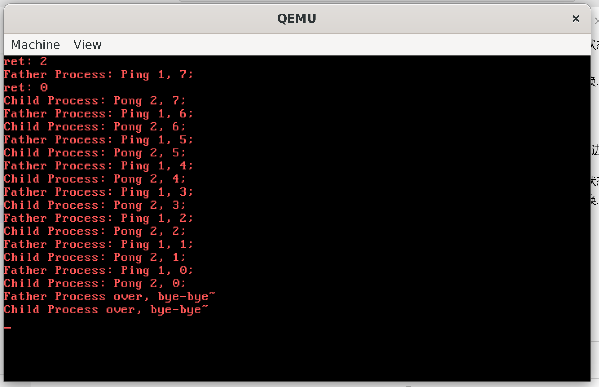

# NJU操作系统2023秋Lab3实验报告

姓名: 闻嘉迅  
学号: 211220091  
日期: 2023.11.15(最后修改)  
版本: v1.0  

## 实验进度
完成全部内容(除选做)  

## 实验代码和结果

### 进程切换 

在`shift_proc`函数中进行进程切换,具体行为如下:  
- 搜索`pcb`数组中的进程,选择状态为`STATE_RUNNABLE`的进程为下一个运行的进程.  
- 更改`current`的值并将选定进程的状态更新为`STATE_RUNNING`.  
- 根据内核栈的状态更新各寄存器值并从中断中返回.  
  
切换方式类似轮转调度.  

```c
void shift_proc(struct StackFrame *sf){
    int i=-1;
    for (i = (current+1)%MAX_PCB_NUM; i != current; i=(i+1)%MAX_PCB_NUM){
        if (pcb[i].state == STATE_RUNNABLE)break;
    }
    if (current == i){
        if(pcb[i].state == STATE_RUNNABLE)current = i;
        else current = 0;
    }
    else current = i;
    pcb[current].state = STATE_RUNNING;
    uint32_t tmpStackTop = pcb[current].stackTop;
    tss.esp0 = pcb[current].prevStackTop;
    pcb[current].stackTop = pcb[current].prevStackTop;
	asm volatile("movl %0, %%esp"::"m"(tmpStackTop));
    asm volatile("popl %gs");
	asm volatile("popl %fs");
	asm volatile("popl %es");
	asm volatile("popl %ds");
	asm volatile("popal");
	asm volatile("addl $8, %esp");
	asm volatile("iret");
}
```

### 时钟中断  

在时钟中断到来时,调用`timerHandle`函数进行处理.  
在`timerHandle`函数中,首先遍历`pcb`数组,将阻塞状态的进程的休眠时间减一并更新进程状态.再将`current`进程的运行时间加一,若运行时间达到了时间片最大值,则将其状态更新为就绪.最后检查`current`进程,若状态不为运行,则切换进程.  

### 系统调用

对于`fork() sleep() exit()`三个函数,分别执行相应的系统调用,其中sleep的参数通过`%ecx`寄存器传输.在`syscallHandle`函数中,增加对应fork,sleep,exit对应调用号的分支.  

### syscallFork

`syscallFork`实现新建进程的操作:  

- 遍历`pcb`数组,寻找状态为`STATE_DEAD`的进程作为新进程的`pcb`.  
- 若遍历失败,返回-1,结束.  
- 否则,获取新的`pid`并为进程分配空间并将数据复制.  
- 随后复制`pcb`的内容,将新进程的状态设置为就绪并设定返回值(即`%eax`的值).  

### syscallSleep

`syscallSleep`实现进程休眠的操作:

- 将当前进程状态设为阻塞,并将休眠时间设为`%ecx`寄存器的值.  
- 执行进程切换.  
  
### syscallExit

`syscallExit`实现进程结束的操作:  

- 将当前进程状态设为死亡.  
- 执行进程切换.  

### 实验结果

运行结果如下:  


## 思考题  

### 1
`fork`会创建一个新的进程作为父进程的副本,而`exec`不会创建进程,而会将原有进程的代码和数据替换为待执行的程序.  
### 2
1. `fork` 函数：
   - 功能：创建一个新的进程，新进程是调用进程的副本。
   - 影响进程状态：在调用 `fork` 之后，父进程和子进程都开始执行从 `fork` 调用点之后的代码。两者是相互独立的，各自有自己的内存空间和寄存器状态。
   - 返回值：在父进程中，`fork` 返回子进程的 PID，而在子进程中，`fork` 返回 0。通过这个返回值，父子进程可以根据不同的情况执行不同的操作。
2. `exec` 函数：
   - 功能：执行一个新的程序，替代当前进程的地址空间、代码段、数据段等。
   - 影响进程状态：`exec` 不创建新进程，而是将当前进程的内容替换为新程序的内容。进程的 PID 和一些其他属性会保持不变，但进程的执行状态会完全由新程序取代。
   - 返回值：如果 `exec` 函数执行成功，它不会返回。如果执行失败，`exec` 会返回一个负值表示错误。
3. `wait` 函数：
   - 功能：父进程调用 `wait` 函数等待子进程的终止。
   - 影响进程状态：`wait` 会挂起父进程的执行，直到它的一个子进程终止。当子进程终止时，`wait` 会返回子进程的 PID。
4. `exit` 函数：
   - 功能：终止当前进程。
   - 影响进程状态：`exit` 会终止当前进程的执行，释放它占用的资源。同时，它会向父进程传递一个退出状态，这个状态可以由 `wait` 函数获取。
### 3
- kernel通过`fork`等函数新建进程.  
- kernel为新进程分配地址空间并将用户程序加载到该地址空间,并将进程状态设定为就绪.  
- 等待调度器选择该进程.  
- 若选择了该进程,将状态设定为运行,并进行上下文切换.  
- 上下文切换完毕后,返回用户态,`%eip`寄存器被设定在程序入口点,开始执行第一条指令.  
### 4
若要继续当前进程,正常返回并恢复`stackTop`即可,若要切换进程,则需切换内核栈并弹出各寄存器保存值.TSS段需要改变.