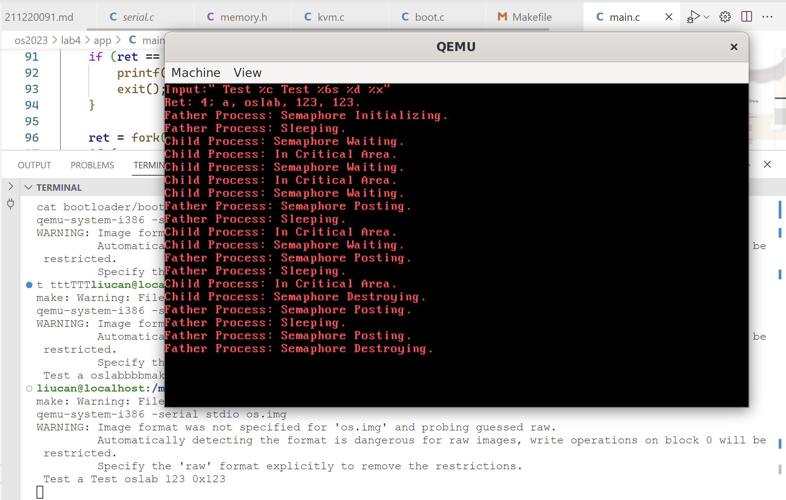
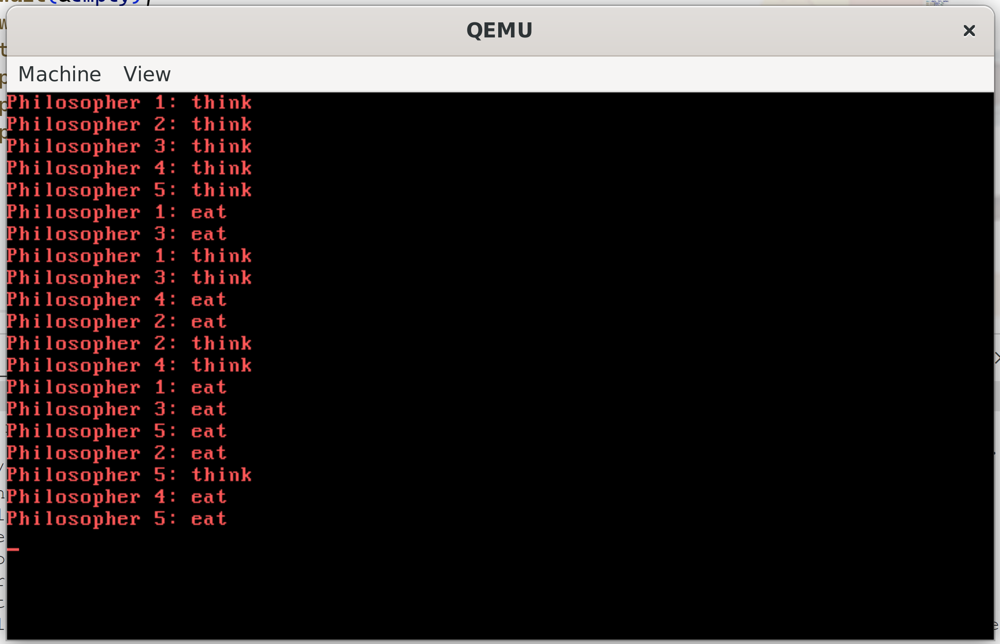
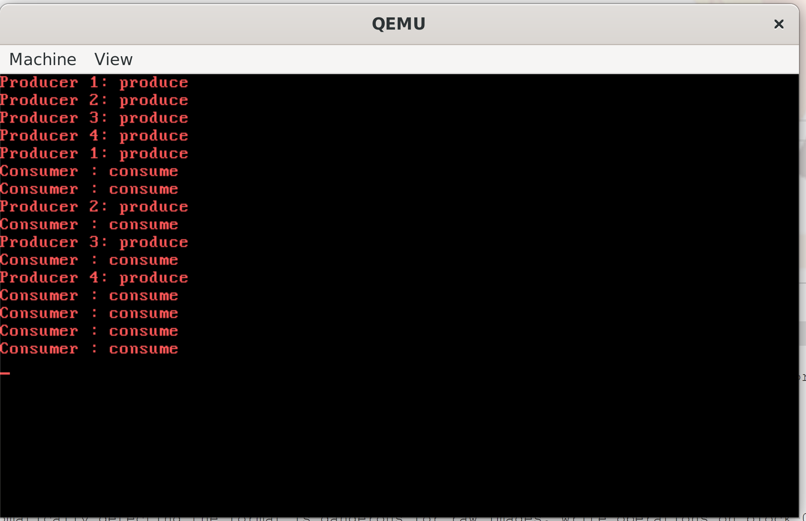

# NJU操作系统2023秋Lab4实验报告

姓名: 闻嘉迅  
学号: 211220091  
日期: 2023.12.9(最后修改)  
版本: v1.0  

## 实验进度
完成全部内容和生产者消费者问题.  

## 实验代码和结果

### syscallReadStdIn

首先判断标准输入是否可用,若不可用则返回-1.  
否则将该线程阻塞在标准输入设备上,等待唤醒后将键盘输入缓冲区中的字符复制到相应字符串中,并返回读取字节数.

### 键盘缓冲区处理

若键盘进行输入,则更新键盘缓冲区并释放标准输入,唤醒阻塞在标准输入上的一个进程.  

### 信号量

1. **syscallSemInit**:
   - 功能：初始化信号量。
   - 分析：在已经定义的信号量数组 `sem` 中找到一个空闲的位置，将其状态置为1（表示被占用），设置其初始值为由 `sf->edx` 提供的值，并将对应进程加入到信号量的等待队列。
   - 返回值：通过 `pcb[current].regs.eax` 返回找到的信号量的索引。

2. **syscallSemWait**:
   - 功能：等待信号量。
   - 分析：首先获取由 `sf->edx` 提供的信号量索引。如果该信号量不存在（state为0），则返回-1；否则，将信号量的值减1，若减1后小于0，则将当前进程置为阻塞状态，加入到信号量的等待队列中，并触发系统调用（`int $0x20`）进行进程切换。
   - 返回值：通过 `pcb[current].regs.eax` 返回操作的结果。

3. **syscallSemPost**:
   - 功能：发送信号量。
   - 分析：首先获取由 `sf->edx` 提供的信号量索引。如果该信号量不存在（state为0），则返回-1；否则，将信号量的值加1，若加1后小于等于0，则唤醒信号量等待队列中的一个进程（将其从阻塞状态改为可运行状态）。
   - 返回值：通过 `pcb[current].regs.eax` 返回操作的结果。

4. **syscallSemDestroy**:
   - 功能：销毁信号量。
   - 分析：首先获取由 `sf->edx` 提供的信号量索引。如果该信号量不存在（state为0），则返回-1；否则，将信号量的状态置为0，触发系统调用（`int $0x20`）进行进程切换。
   - 返回值：通过 `pcb[current].regs.eax` 返回操作的结果。

### 实验结果

运行结果如下:  

## 思考题  

### 1
有影响,例如:在生产者消费者问题中,若生产者的P(&empty)和P(&mutex),消费者的P(&full)和P(&mutex)顺序颠倒,在缓冲区为空的情况下,可能会出现以下情况:消费者获取mutex并在full上阻塞,随后进程切换生产者在mutex上阻塞,造成死锁.  
### 2
信号量（Semaphore）和互斥量（Mutex）是用于多线程编程中实现同步的两种不同的机制，它们有一些关键的区别：

1. **功能：**
   - **信号量：** 信号量是一个计数器，用于控制多个线程对共享资源的访问。它允许多个线程同时访问某个资源，但是通过信号量的计数来限制对资源的并发访问数量。
   - **互斥量：** 互斥量用于保护共享资源，确保在任何时刻只有一个线程可以访问这个资源。它提供了排他性，防止多个线程同时进入临界区。

2. **计数：**
   - **信号量：** 信号量的计数可以是任意整数，通常用于表示可用资源的数量。
   - **互斥量：** 互斥量的计数要么是 0（锁定状态），要么是 1（解锁状态）。

3. **操作：**
   - **信号量：** 信号量提供 P（等待）和 V（释放）操作。P操作减少信号量的计数，如果计数变为负数，则线程会阻塞。V操作增加信号量的计数，唤醒等待的线程。
   - **互斥量：** 互斥量提供 Lock（锁定）和 Unlock（解锁）操作。Lock操作将互斥量的计数减为 0，如果已经是 0，则线程会阻塞。Unlock操作将计数增加为 1。

4. **用途：**
   - **信号量：** 适用于控制资源的并发访问，例如限制同时访问某个资源的线程数量。
   - **互斥量：** 适用于保护共享资源，确保在任何时刻只有一个线程可以访问。

5. **复杂性：**
   - **信号量：** 信号量更灵活，可以用于更复杂的同步机制，如生产者-消费者问题。
   - **互斥量：** 互斥量提供更简单、更直接的互斥访问。