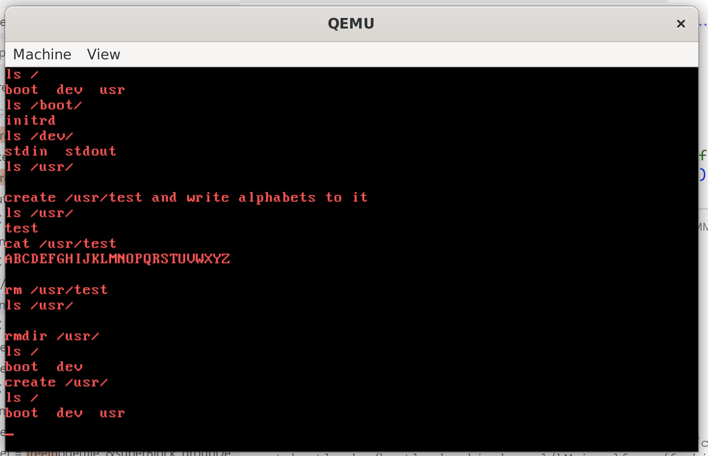

# NJU操作系统2023秋Lab5实验报告

姓名: 闻嘉迅  
学号: 211220091  
日期: 2024.1.9(最后修改)  
版本: v1.0  

## 实验进度
完成全部内容.  

## 实验代码和结果

### 文件的打开

主要过程在syscallOpen函数中： 

1. 函数 `syscallOpen` 接受一个指向 `StackFrame` 结构的指针作为参数，该结构可能包含有关系统调用参数和状态的信息。

2. 从栈帧中提取相关信息，如文件路径 (`str`)、文件访问标志 (`sf->edx`) 和其他参数。

3. 尝试读取指定文件的 Inode（使用 `readInode` 函数），以检查文件是否已存在。

4. 如果文件存在，检查指定的标志是否适用于文件类型（常规文件或目录）。如果不适用，则设置错误代码 (`sf->eax = -1`) 并返回。

5. 如果文件不存在，并且允许创建（`(sf->edx >> 2) % 2 == 0`），则尝试创建文件。这涉及解析文件路径、识别父目录并为文件分配新的 Inode。

6. 根据文件类型（常规文件或目录），相应地设置 `tmp` 变量。

7. 分配新的 Inode 给文件（使用 `allocInode` 函数），并在文件数组中更新文件信息。

8. 如果成功，将当前进程的 `eax` 寄存器中设置返回值。

9. 如果在过程中发生任何错误，将在 `eax` 中设置适当的错误代码。

10. 代码使用一个固定大小的数组 (`file[MAX_FILE_NUM]`) 来跟踪打开的文件。

### 文件的读取

首先对输入的`fd`进行判断，若为标准输入则使用标准输入读取，若为可用文件则交由相应函数读取。 
主要过程在syscallWriteFile函数中：

1. 首先，检查打开文件的标志，确保文件被打开用于写操作（O_WRITE 标志被设置）。

2. 获取系统调用参数，包括文件描述符（在 `sf->ecx` 中），用户缓冲区地址（在 `sf->edx` 中），以及写入的字节数（在 `sf->ebx` 中）。

3. 计算基地址，用于访问用户进程的内存。

4. 从文件数组中获取文件的偏移信息、Inode 数据和块大小。

5. 通过 `diskRead` 读取文件的 Inode。

6. 如果要写入的字节数小于等于0，则返回错误代码。

7. 进行文件写入的主要逻辑，使用一个循环来处理写入操作。循环中首先检查当前块是否足够大，如果不够大，则分配一个新的块。然后从用户缓冲区中读取数据，写入到文件的块中。

8. 更新 Inode 的大小和写入的偏移，并通过 `diskWrite` 写回到磁盘。

9. 最后，更新文件数组中的偏移信息和返回写入的字节数。

### 文件的写入

`fd`的判断与上一节类似。
主要过程在syscallReadFile函数中：

1. 首先，检查打开文件的标志，确保文件被打开用于读操作（O_READ 标志被设置）。

2. 获取系统调用参数，包括文件描述符（在 `sf->ecx` 中）、用户缓冲区地址（在 `sf->edx` 中）、以及要读取的字节数（在 `sf->ebx` 中）。

3. 计算基地址，用于访问用户进程的内存。

4. 从文件数组中获取文件的偏移信息、Inode 数据和块大小。

5. 通过 `diskRead` 读取文件的 Inode。

6. 如果要读取的字节数小于等于0或者文件已经读取完毕（偏移量超过文件大小），则返回错误代码。

7. 进行文件读取的主要逻辑，使用一个循环来处理读取操作。循环中首先检查当前块是否足够大，然后从文件的块中读取数据，写入用户缓冲区。

8. 更新文件数组中的偏移信息和返回读取的字节数。


### fseek操作

主要过程在syscallLseek函数中：

1. 从系统调用参数中获取文件描述符（在 `sf->ecx` 中）和偏移量（在 `sf->edx` 中）。

2. 首先，检查文件描述符的有效性，确保它处于文件描述符的有效范围内，并且对应的文件处于打开状态。

3. 通过 `diskRead` 读取文件的 Inode。

4. 根据 `sf->ebx` 的值判断 `whence` 参数（文件定位方式）：

   - 如果 `whence` 是 `SEEK_SET`，则根据偏移量直接设置文件偏移量。
   - 如果 `whence` 是 `SEEK_CUR`，则将文件偏移量设加上当前偏移量。
   - 如果 `whence` 是 `SEEK_END`，则将文件偏移量设置为文件大小加上偏移量。

5. 根据定位方式设置文件偏移量，并将新的偏移量存储在 `sf->eax` 中。

### 文件的关闭

主要过程在syscallClose函数中：


1. 从系统调用参数中获取文件描述符（在 `sf->ecx` 中）。

2. 首先，检查文件描述符的有效性，确保它处于文件描述符的有效范围内。

3. 然后，检查文件是否处于打开状态。如果文件状态为 0，表示文件未被使用，直接返回错误代码。

4. 如果文件处于打开状态，将文件的相关信息进行清零或设置为默认值，表示文件已关闭。具体操作包括将文件状态置为 0、Inode 偏移量置为 0、文件偏移量置为 0，文件标志置为 0。

5. 最后，将返回值设为 0 表示成功关闭文件。

### 文件的删除

主要过程在syscallRemove函数中：

1. 从系统调用参数中获取文件路径。

2. 调用 `readInode` 函数，检查文件是否存在。如果文件不存在，直接返回错误代码。

3. 如果文件存在，首先检查文件路径是否以斜杠结尾，如果是，将最后一个字符置为 null 以处理路径。

4. 从文件路径中获取父目录的路径，并调用 `readInode` 函数读取父目录的 Inode。

5. 根据文件的类型（REGULAR_TYPE 或 DIRECTORY_TYPE），调用 `freeInode` 函数释放 Inode。这一步实际上是删除文件或目录。

6. 如果删除操作成功，将返回值设为 0 表示成功删除文件。

### ls和cat指令实现：

**ls部分：** 实现了一个简单的 ls（列出目录内容）函数，通过打开目录文件，读取目录项并输出目录中的文件名。


1. 使用 `open` 函数打开指定目录文件，使用 `O_READ | O_DIRECTORY` 标志表示以只读方式打开目录。

2. 如果打开目录失败，函数返回 -1。

3. 使用 `read` 函数读取目录的内容，将目录项读入缓冲区。

4. 使用循环遍历缓冲区中的目录项，输出每个有效目录项的文件名。

5. 重复步骤 3-4，直到读取完整个目录。

6. 关闭目录文件。

7. 返回 0 表示 ls 函数执行成功。

**cat部分：** 实现了一个简单的 `cat` 函数，用于打印文件内容。以下是对代码的简要说明：

1. 使用 `open` 函数以只读方式打开指定文件。

2. 如果打开文件失败，函数返回 -1。

3. 使用 `read` 函数读取文件内容，将文件内容读入缓冲区。

4. 使用循环遍历缓冲区中的内容，逐字符打印。

5. 重复步骤 3-4，直到读取完整个文件。

6. 关闭文件。

7. 返回 0 表示 `cat` 函数执行成功。

### 实验结果

结果如下图所示：



## 遇到的问题和解决办法

在进行代码测试的时候发现在调用`remove`方法后再运行`ls`函数，发现被删除的文件仍然存在。  
最开始认为是`remove`相关的系统调用实现错误，尝试了几种改进后发现未能解决问题。  
在这之后怀疑是`ls`实现错误，经过检查并阅读`fs.c`中代码后发现问题：在排除无效节点时误认为标号为`-1`的是无效节点，而`fs.c`中的相关函数则将无效节点同意标号为`0`，导致函数无法正常过滤无效节点。  
将`ls`函数中的：  
```c
   if (dirEntry->inode != -1) {
         printf("%s  ", dirEntry->name);
   }
```
更改为：  
```c
   if (dirEntry->inode != 0) {
         printf("%s  ", dirEntry->name);
   }
```
再次进行测试，发现错误不再出现。  

## 思考题  

### 1
计算机处理无序的字节集合通常通过字节操作和指令来完成。计算机的基本存储单元是字节（8位），而无序的字节集合是由多个字节组成的数据。

以下是计算机处理无序字节集合的一般过程：

1. **存储：** 无序字节集合被存储在计算机的内存中。内存是一个线性地址空间，每个字节都有一个唯一的地址。

2. **访问：** 计算机通过指令和地址来访问存储的数据。指令告诉计算机要执行的操作，地址指示数据在内存中的位置。指令集包含了各种用于处理字节和字节集合的操作码。

3. **加载和存储：** 计算机通过加载和存储指令将数据从内存加载到寄存器中进行处理，然后将处理结果存回内存。寄存器是CPU内部的小型存储单元，用于执行操作。

4. **字节操作：** 计算机通过字节级别的操作进行处理，例如加法、减法、逻辑运算等。这些操作通常由特定的指令集提供支持。

5. **数据结构：** 有时，无序字节集合可能表示更复杂的数据结构，如数组、结构体或其他高级数据类型。计算机处理这些结构的方式通常涉及到指针和偏移量的概念，以访问和操作不同的部分。

6. **字节顺序：** 在涉及多字节数据类型（如整数、浮点数）时，计算机体系结构的字节顺序（大端序或小端序）也需要考虑。字节顺序指定了多字节数据类型在内存中的存储顺序。


### 2

当内核处理 `exec` 系统调用时，不需要对进程文件描述符表和系统文件打开表进行修改的主要原因是 `exec` 系统调用的语义。`exec` 系统调用的目的是将一个新的可执行文件加载到当前进程的内存空间中，替换当前进程的执行映像。

1. **新进程的文件描述符表：** `exec` 不会改变当前进程的文件描述符表，因为它是将一个新的可执行文件加载到当前进程的内存中，而不是创建一个全新的进程。因此，新的可执行文件会继承原进程的文件描述符。

2. **系统文件打开表：** `exec` 也不需要修改系统文件打开表。该系统调用的目标是在当前进程的上下文中执行一个新的程序，而不是创建一个新的进程。因此，已打开的文件仍然在相同的文件描述符表中，没有必要对系统文件打开表进行修改。

### 3

`which` 命令用于查找可执行程序的路径，但 `cd` 并不是一个可执行程序，而是一个 shell 的内建命令（builtin command）。内建命令是直接由 shell 解释和执行的命令，而不是通过在文件系统中查找可执行文件来执行。

由于 `cd` 是 shell 的内建命令，它并不对应于一个独立的可执行文件，因此 `which` 命令无法找到 `cd` 命令的路径。`which` 主要用于查找在系统的可执行路径中可以直接执行的命令，而不是用于查找 shell 内建命令。

